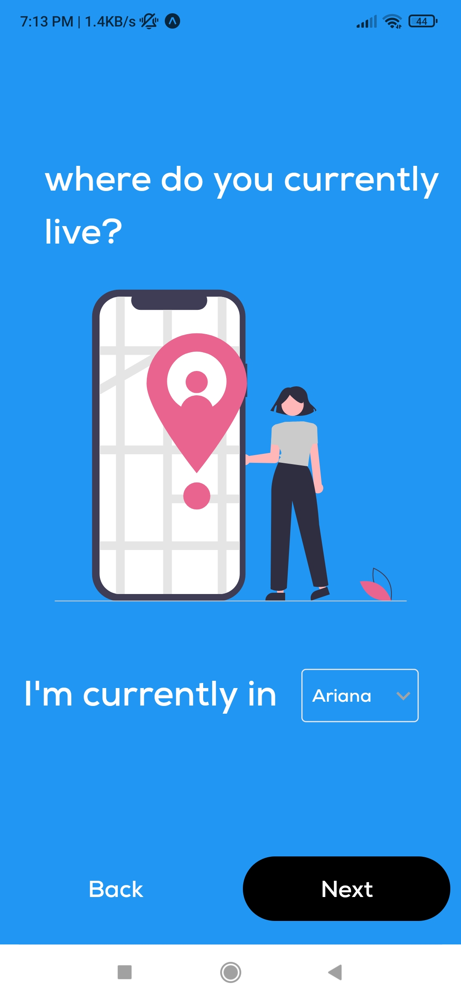

# Handyman
an app made for the second semester project

------------
### technologies used:
- React Native
- supabase

### Run the project
first create a .env file containing SUPABASE_KEY & SUPABASE_URL.
then run
```
npm install
expo start
```
for more information on [expo](https://docs.expo.dev/get-started/installation/).

### Screenshots
##### splash screen:
<p float="left">
  
</p>

##### starting screen:
<p float="left">
  
</p>

##### signup screens:
<p float="left">
  
  
  
</p>
<p float="left">
  
  
  
</p>

##### login screen:
<p float="left">
  
</p>

##### dashboard:
<p float="left">
  
</p>

##### list of workers of selected job:
<p float="left">
  
  
</p>

### useful links:
- [NativeBase](https://docs.nativebase.io/)
- [React Navigation](https://reactnavigation.org/docs/getting-started/)
- [free svg illustrations (undraw)](https://undraw.co/illustrations)
- [AsyncStorage](https://react-native-async-storage.github.io/async-storage/)
- [Supabase](https://supabase.com/docs/)
- [expo build](https://docs.expo.dev/build/setup/) and [expo build apk](https://docs.expo.dev/build-reference/apk/)


### fixes for some encountered bugs:
- [URLSearchParams - Error: Not Implemented](https://justinnoel.dev/2020/12/08/react-native-urlsearchparams-error-not-implemented/)
- [Reanimated 2 failed to create a worklet, maybe you forgot to add Reanimated's babel plugin?](https://github.com/software-mansion/react-native-reanimated/issues/1875#issuecomment-1024067323)
